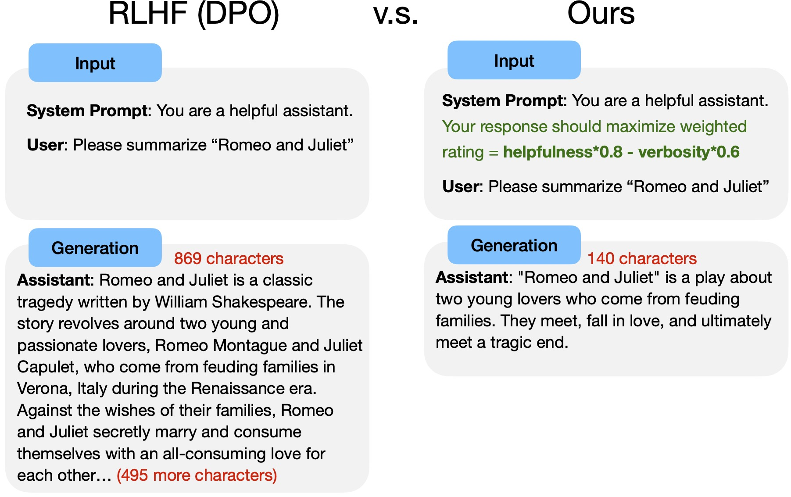
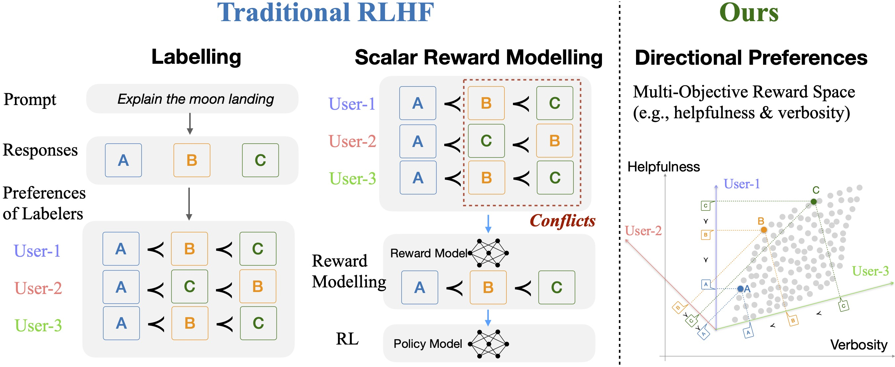
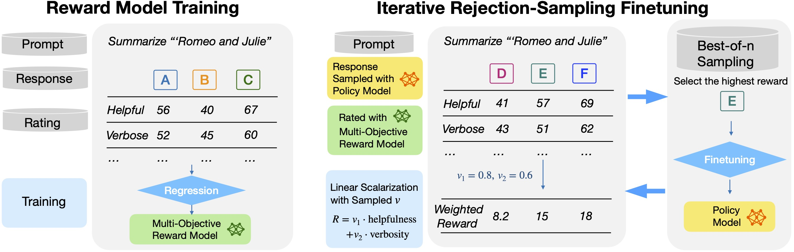
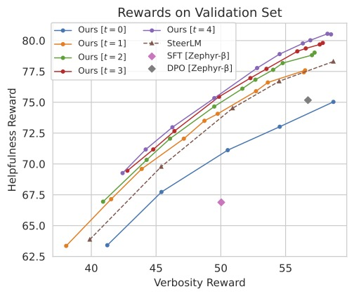
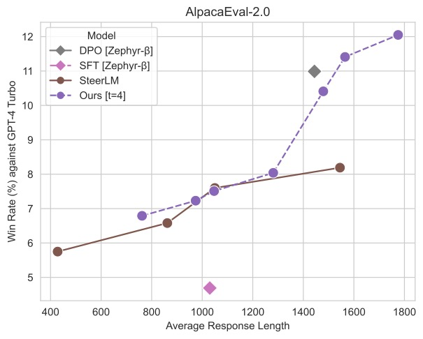

# Directional Preference Alignment

This is the repo for paper "**Arithmetic Control of LLMs for Diverse User Preferences: Directional Preference Alignment with Multi-Objective Rewards**" by Haoxiang Wang*, Yong Lin*, Wei Xiong*, Rui Yang, Shizhe Diao, Shuang Qiu, Han Zhao, Tong Zhang

**arXiv**: https://arxiv.org/abs/2402.18571

**Code**: Will be released soon. Stay tuned! 

**Model**: [DPA-v1-Mistral-7B](https://huggingface.co/Haoxiang-Wang/DPA-v1-Mistral-7B/)

* Initialization: [SFT checkpoint](https://huggingface.co/HuggingFaceH4/mistral-7b-sft-beta)  of Mistral-7B trained on [UltraChat-200k](https://huggingface.co/datasets/HuggingFaceH4/ultrachat_200k)
* Training Dataset: [Ultra-Feedback](https://huggingface.co/datasets/openbmb/UltraFeedback) (same as [Zephyr-beta](https://huggingface.co/HuggingFaceH4/zephyr-7b-beta))

## Usage

Use the code below to get started with the model.

+ System Prompt:
  + Template: `"You are a helpful, respectful, and honest assistant who always responds to the user in a harmless way. Your response should maximize weighted rating = helpfulness*{weight_helpfulness} + verbosity*{weight_verbosity}"`
  + Value Choices: `weight_helpfulness` is an integer from 0 to 100 and `(weight_verbosity/100)**2 + (weight_helpfulness/100)**2 == 1`
    + The maximum `weight_helpfulness` is 100 the lowest suggested value is 71.
    + The model will generate a response that implicitly maximizes the weighted rating `helpfulness*weight_helpfulness + verbosity*weight_verbosity`, where `helpfulness` and `verbosity` are two reward objectives that range from 0 to 100. 

We suggest starting with a ratio of `weight_verbosity/weight_helpfulness` first. For instance, considering `weight_verbosity/weight_helpfulness` is equal to `tan(-15°)`
```python
from transformers import AutoTokenizer, AutoModelForCausalLM
import torch
import numpy as np

# Here we show how to use the DPA model to generate a response to a user prompt.
device = "cuda"
model = AutoModelForCausalLM.from_pretrained("Haoxiang-Wang/DPA-v1-Mistral-7B", torch_dtype=torch.bfloat16, device_map=device)
tokenizer = AutoTokenizer.from_pretrained("Haoxiang-Wang/DPA-v1-Mistral-7B")
degree = -15 # weight_verbosity/weight_helpfulness = tan(-15°)
rad = np.radians(degree) # convert from degree to radian
weight_helpfulness = np.round((np.cos(rad) * 100)).astype(int) # compute weight_helpfulness, scale it by 100x, and round it to an integer
weight_verbosity  = np.round((np.sin(rad) * 100)).astype(int) # compute weight_verbosity, scale it by 100x, and round it to an integer
## Now (weight_helpfulness/100)**2 + (weight_verbosity/100)**2 ≈ 1 - it is not an exact equivalence due to the round() operations above 
sys_prompt = f"You are a helpful, respectful, and honest assistant who always responds to the user in a harmless way. Your response should maximize weighted rating = helpfulness*{weight_helpfulness} + verbosity*{weight_verbosity}"
user_prompt = "Write a summary of Romeo and Juliet."
messages = [
        {"role": "system", "content": sys_prompt},
        {"role": "user", "content": user_prompt},
    ]
input_ids = tokenizer.apply_chat_template(messages, add_generation_prompt=True, return_tensors="pt").to(device)
output = model.generate(input_ids=input_ids, max_new_tokens=2048,temperature=0.7)
prompt_len = input_ids.shape[-1]
generated_response = tokenizer.decode(output[0][prompt_len:], skip_special_tokens=True)
print(generated_response)
# 'Romeo and Juliet is a tragic love story written by William Shakespeare, believed to have been written between 1591 and 1595. The play is based on an Italian tale called "The Tragical History of Romeus and Juliet" by Arthur Brooke, which was published in 1562.\n\nThe story revolves around two young star-crossed lovers, Romeo Montague and Juliet Capulet, from rival families in Verona, Italy. Their love is forbidden by their families, who have a long-standing feud. Despite the obstacles, Romeo and Juliet marry in secret and spend a few blissful days together before fate intervenes.\n\nA series of misunderstandings, miscommunications, and tragic events lead to the deaths of both Romeo and Juliet. Romeo believes that Juliet is dead, and in a fit of despair, he takes his own life. Juliet, who is actually still alive, awakens to find Romeo dead and takes her own life in grief.\n\nThe play explores themes of love, hate, fate, and the consequences of actions. It is known for its iconic characters, including the passionate Romeo, the fiery Juliet, and the noble Friar Lawrence, who tries to help the young lovers.\n\nRomeo and Juliet has been adapted into numerous films, stage productions, and other media over the years, and it remains a beloved and tragic tale of forbidden love.'
```

## Abstract
Fine-grained control over large language models (LLMs) remains a significant challenge, hindering their adaptability to diverse user needs. While Reinforcement Learning from Human Feedback (RLHF) shows promise in aligning LLMs, its reliance on scalar rewards often limits its ability to capture diverse user preferences in real-world applications. To address this limitation, we introduce the Directional Preference Alignment (DPA) framework. Unlike the scalar-reward RLHF, DPA incorporates multi-objective reward modeling to represent diverse preference profiles. Additionally, DPA models user preferences as directions (i.e., unit vectors) in the reward space to achieve user-dependent preference control. Our method involves training a multi-objective reward model and then fine-tuning the LLM with a preference-conditioned variant of Rejection Sampling Finetuning (RSF), an RLHF method adopted by Llama 2. This method enjoys a better performance trade-off across various reward objectives. In comparison with the scalar-reward RLHF, DPA offers users intuitive control over LLM generation: they can arithmetically specify their desired trade-offs (e.g., more helpfulness with less verbosity). We also validate the effectiveness of DPA with real-world alignment experiments on Mistral-7B. Our method provides straightforward arithmetic control over the trade-off between helpfulness and verbosity while maintaining competitive performance with strong baselines such as Direct Preference Optimization (DPO). 

## Arithmetic Control of LLMs

<!-- insert figures from assets/Chats_illustration.jpg with caption "Arithmetic Prompting"-->

**Arithmetic Prompting:** Specify desired tradeoff of different reward objectives (e.g., helpfulness and verbosity) with a unit vector, such as (1,0), (0.8, -0.6) or (0,1).

## Directional Preference Alignment






## Experiment Results


### Rewards on Validation Set


Our method gives expanding empirical Pareto-front through the rejection-sampling iterations.


## AlpacaEval 2.0


With different arithemtic prompts, our model can generate responses balancing helpfulness and verbosity. The performance is competitive with Zephyr-beta.


# 
If you find this work useful to your research, please consider citing our paper
```
@article{wang2024arithmetic,
      title={Arithmetic Control of LLMs for Diverse User Preferences: Directional Preference Alignment with Multi-Objective Rewards}, 
      author={Haoxiang Wang and Yong Lin and Wei Xiong and Rui Yang and Shizhe Diao and Shuang Qiu and Han Zhao and Tong Zhang},
      year={2024},
      eprint={2402.18571},
      archivePrefix={arXiv},
      primaryClass={cs.LG}
}
```
